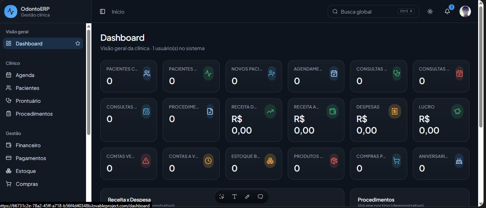

# Clinic-Flow
## Sistema de gestão para clinicas odontologicas

O clinic flow e um sistema desenvolvido para auxiliar clinas odontologicas, na gestão do consultorio facilitando a organização dos atendimentos e processos adiministrativos

## Funcionalidades
- Agendadamento de consultas
- Cadastros e gestão de pacientes
- Prontuario medicos
- Procedimentos medicos
- Financeiro
- Pagamentos
- Estoque
- Compras
## Proximos passos
-CRM 
-Comunicação
-Relatorios
## Tecnologias utilizadas
-Lovable
-SuperBase com front end e back end

Como acesssar o projeto
O projeto esta disponivel online com o link abaixo
https://clear-dental-vista.lovable.app

##Hold Map

###CRM
-Funil de atendimento
-Orçamentos e conversão
-Pacientes inativos
-Campanhas
Follow-up e retorno

###Comunicação
-Whatsapp, e-email e SMS
-Lembretes automáticos
-Confirmação de Consultas
-Pesquisa de Satisfação
-Aniversários
-Cobranças
###Realatórios
-Financeiro
Agenda
Pacientes
Procedimento
Dentistas
Estoque e Compras
Exportação PDF e Excel

